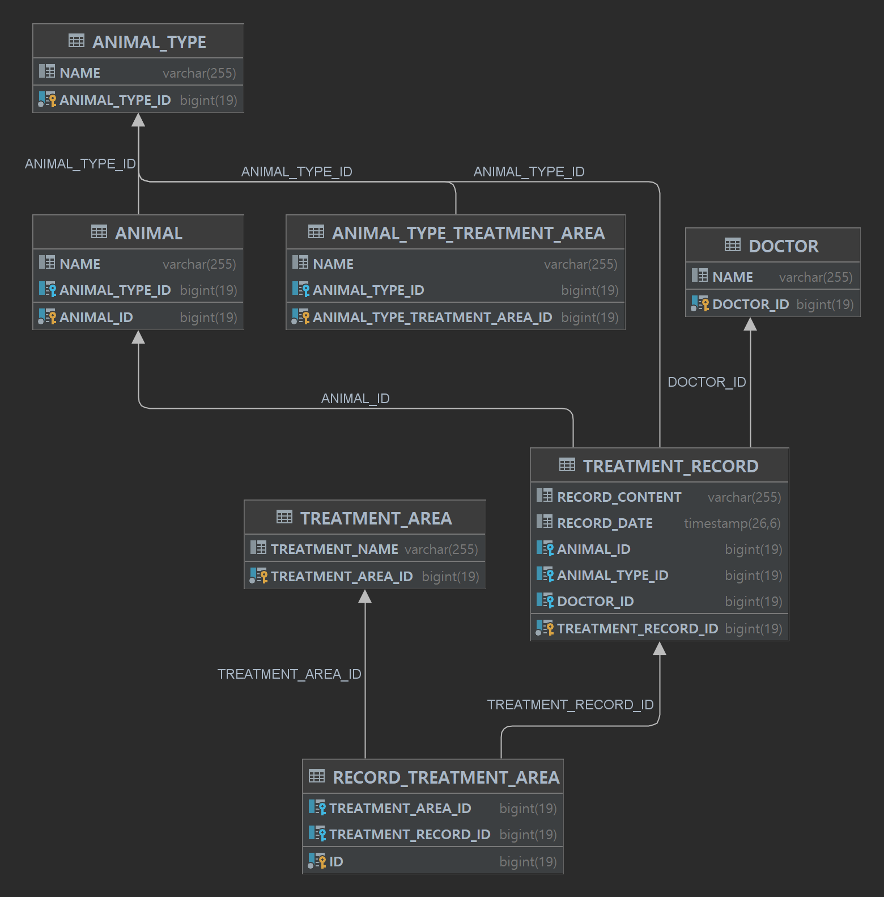
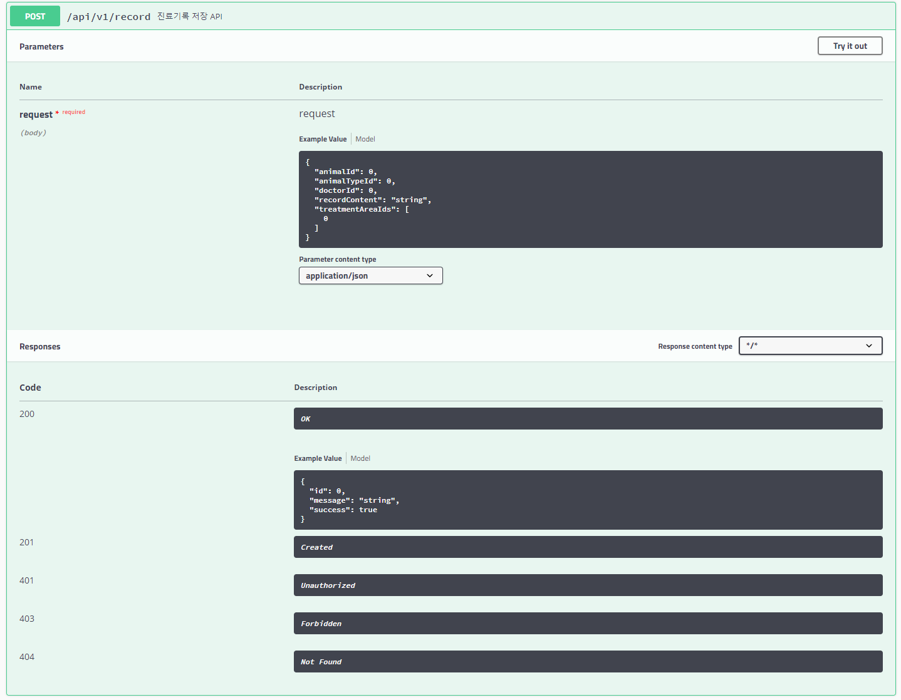
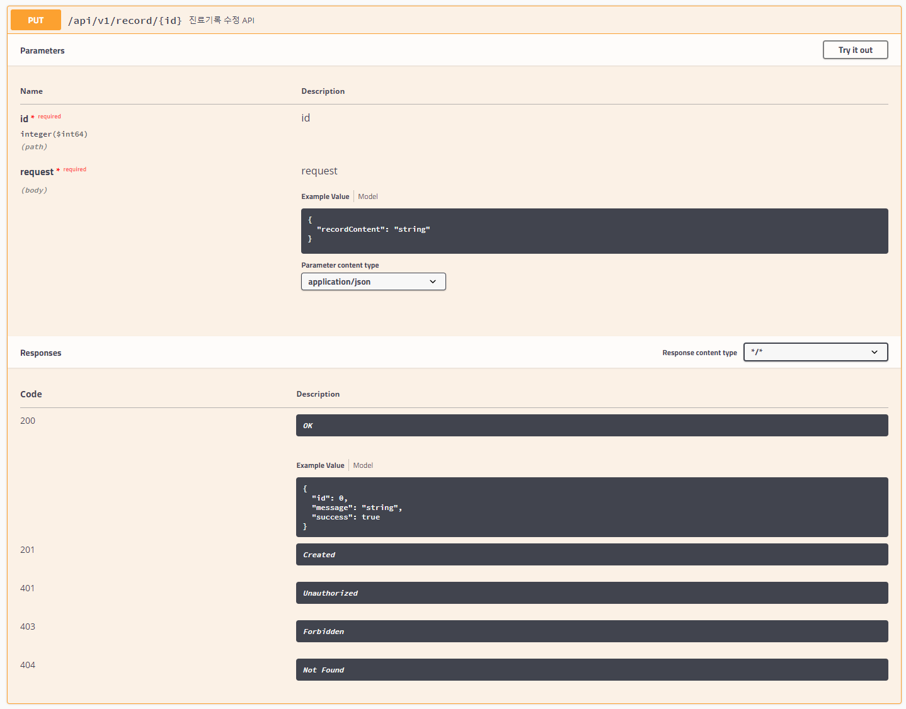
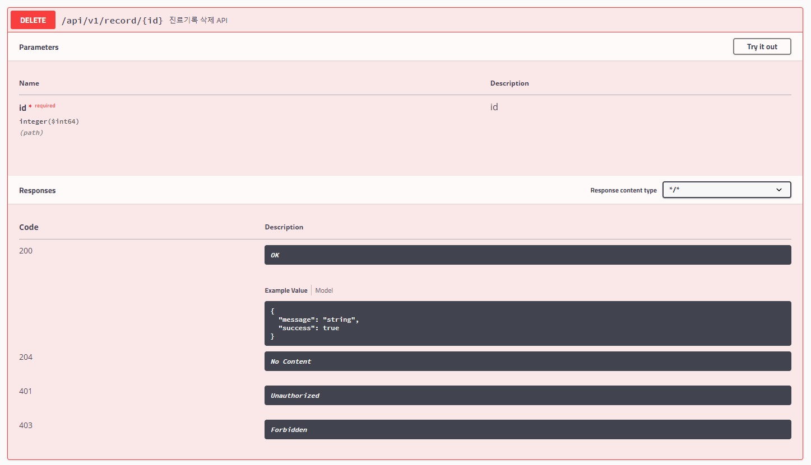
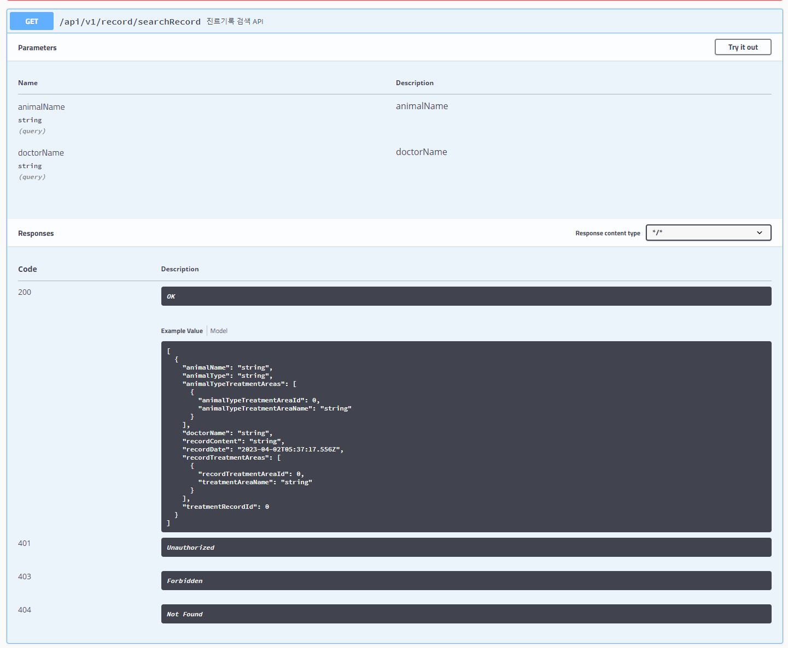
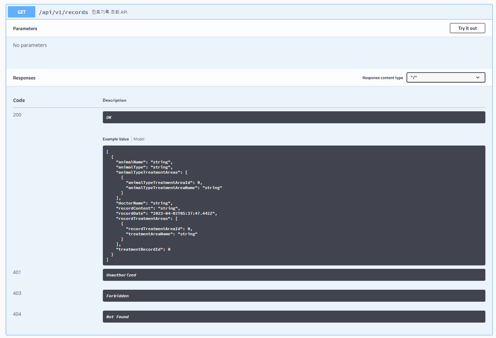
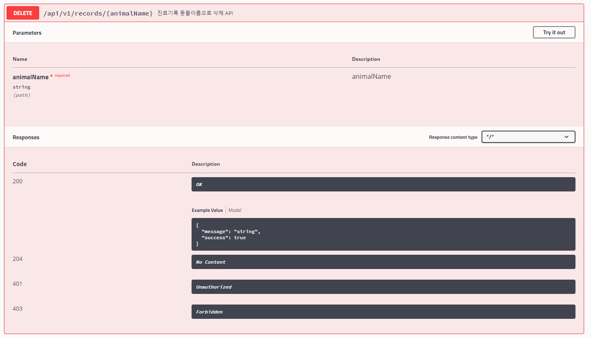

### 프로젝트 구성 

### 기능목록
- {host 주소}/swagger-ui.html#
- 해당 주소에서 상세 api 명세서를 확인 할 수 있습니다.  
 
  
 
- 진료기록 저장  
 
  
 
- 진료기록 수정  
 
  
 
- 진료기록 삭제  
 
  
 
- 진료기록 검색  
 
  
 
- 진료기록 조회  
 
  
 
- 진료기록 삭제(동물이름)  
 

